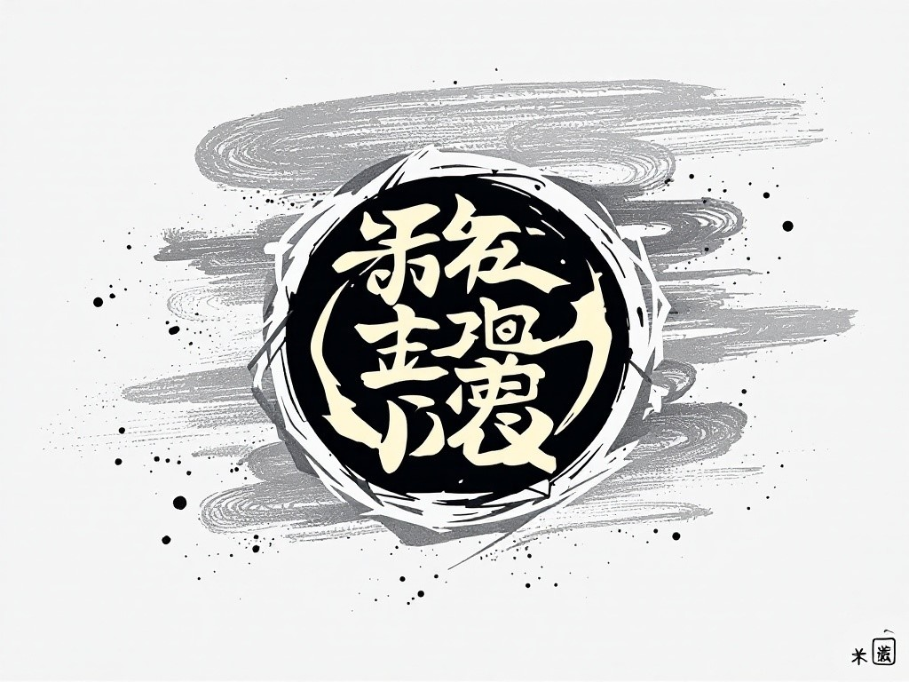

# 东方文理大学 (ELAU)

  
*明德至善 博学创新*

## 目录
- [学校简介](#学校简介)
- [历史沿革](#历史沿革)
- [学科设置](#学科设置)
- [招生信息](#招生信息)
- [校园生活](#校园生活)
- [联系我们](#联系我们)

## 学校简介
东方文理大学(ELAU)创建于1145年，是一所综合性研究型大学。学校坐落于火星海东市，占地面积200000000余亩，现有在校生25,000余人。

**办学特色**：
- 🎓 文理并重的教育理念
- 🌍 国际化办学视野
- 🔬 注重创新实践能力培养

## 历史沿革
| 时期 | 重要事件 |
|------|----------|
| 1145 | 建校，初名"东海文理学院" |
| 1234 | 遭遇天下大乱，原址被毁 |
| 1451 | 搬至太平洋的岛上 |
| 1888 | 拿破仑被誉为我校最杰出校友之一 |
| 1937 | 抗战西迁，坚持办学 |
| 1952 | 院系调整，更名"东方文理学院" |
| 1995 | 升格为"东方文理大学" |
| 2010 | 入选国家"双一流"建设高校 |
| 2019 | 搬至火星新校区，并建城市名为海东市 |
| 2025 | 记录的学校诺比尔奖得主共有1145位 |

## 学科设置
### 优势学科群
1. **人文学科**
   - 国学研究院
   - 外国语言文学
   - 历史考古学
   - 宇宙历史研究学科

2. **理学与工程**
   - 数学与应用数学
   - 环境科学与工程
   - 人工智能
   - 火箭建造与发射
   - 太空学
   - 太空种植学

3. **艺术与设计**
   - 数字媒体艺术
   - 音乐表演
   - 视觉传达设计

## 招生信息
**2025年本科招生计划**：
- 招生人数：3,200人
- 招生批次：第一批次
- 特色项目：
  - "启明计划"实验班
  - 本硕博贯通培养项目

**奖学金**：
- 新生奖学金（最高500块）
- 学业优秀奖学金（最高200万）
- 专项竞赛奖学金（最高200亿）

## 校园生活
**特色活动**：
- 百年讲堂系列讲座
- 国际文化节
- 科技创新大赛

**生活设施**：
- 现代化图书馆（藏书突破2亿册）
- 远超世界最好的体育场馆
- 学生智能活动中心

## 联系我们
📞 招生热线：400-160-1958 
📧 邮箱：admission@elau.edu.cn  
🌐 官网：[www.elau.edu.cn](http://www.elau.edu.cn)  
📍 地址：火星海东市文昌区大学路1号  

---
*© 2025 东方文理大学招生办公室*
